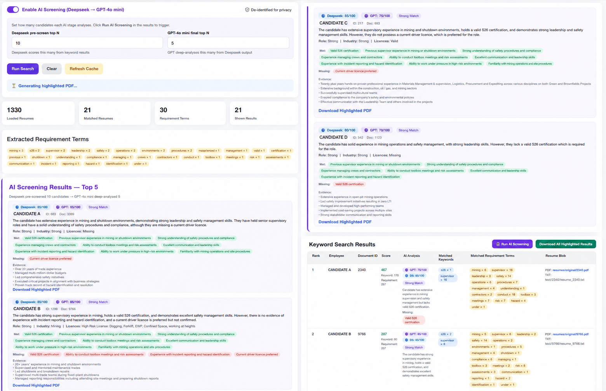
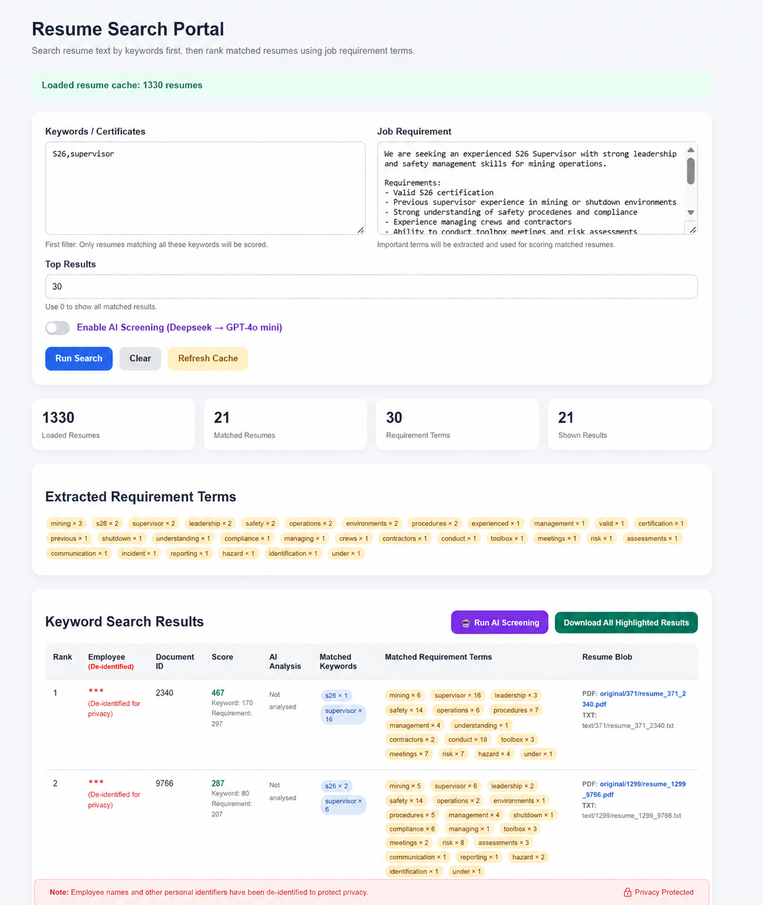
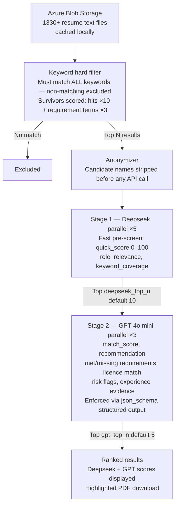

# Resume Filter — AI-Powered Resume Screening Portal

A Flask web app that screens resumes from Azure Blob Storage using a three-stage pipeline: keyword filtering → Deepseek pre-screening → GPT-4o mini deep analysis. Built for labour hire, mining, civil, and industrial recruitment.

---

## Screenshots

### Keyword search + AI screening results


### De-identified view (for privacy)


---

## Pipeline



---

## Features

- **Keyword hard filter** — resumes must contain all specified keywords to proceed
- **Requirement term scoring** — key terms auto-extracted from job description and used for scoring
- **Two-stage AI screening** — Deepseek fast pre-screen → GPT-4o mini deep analysis
- **Privacy by design** — candidate names anonymized before any API call; de-identified UI for demos
- **Highlighted PDF download** — matched keywords and requirement terms highlighted in original PDF
- **Azure Blob Storage** — resumes stored in Azure, cached locally for instant search
- **Parallel AI processing** — Deepseek runs 5 concurrent workers, GPT runs 3

---

## Tech Stack

| Layer | Technology |
|---|---|
| Backend | Python, Flask |
| Storage | Azure Blob Storage |
| PDF processing | PyMuPDF (fitz) |
| AI — Stage 1 | Deepseek API (deepseek-chat) |
| AI — Stage 2 | OpenAI GPT-4o mini |
| Parallelism | concurrent.futures.ThreadPoolExecutor |

---

## Setup

### 1. Clone the repo

```bash
git clone https://github.com/your-username/ResumeFilter.git
cd ResumeFilter
```

### 2. Install dependencies

```bash
pip install -r requirements.txt
```

### 3. Configure `.env`

```env
AZURE_STORAGE_CONNECTION_STRING=your_azure_connection_string
AZURE_BLOB_CONTAINER=resumes

OPENAI_API_KEY=sk-your-openai-key
OPENAI_MODEL=gpt-4o-mini

DEEPSEEK_API_KEY=sk-your-deepseek-key
DEEPSEEK_MODEL=deepseek-chat
```

### 4. Run

```bash
python APP.py
```

Visit `http://localhost:5000`

---

## Usage

1. Enter keywords — e.g. `S26, supervisor` (resumes must contain all)
2. Paste the job requirement description
3. Set how many results to show (0 = all)
4. Click **Run Search** — keyword filter runs instantly from local cache
5. Click **Run AI Screening** — sends top candidates through Deepseek → GPT pipeline
6. Download individual highlighted PDFs or all results as a ZIP

---

## Project Structure

```
ResumeFilter/
├── APP.py                  # Flask routes, search logic, server-side state
├── ai_screener.py          # Two-stage parallel AI screening pipeline
├── anonymizer.py           # Name anonymization before API calls
├── requirements.txt
└── templates/
    └── resumesearch1.html  # Frontend UI
```

---

## Privacy

All candidate names are anonymized before being sent to any external AI API. The original resume data in Azure Blob Storage is never modified. The UI includes a de-identified display mode for demos and portfolio use.

---

## Notes

- On first run, resumes are loaded from Azure Blob and cached to `resume_cache.json`
- Subsequent runs load from local cache for fast startup
- Click **Refresh Cache** to re-sync from Azure after resume updates
- `SEARCH_STATE` is stored in server memory — designed for single-user local deployment
